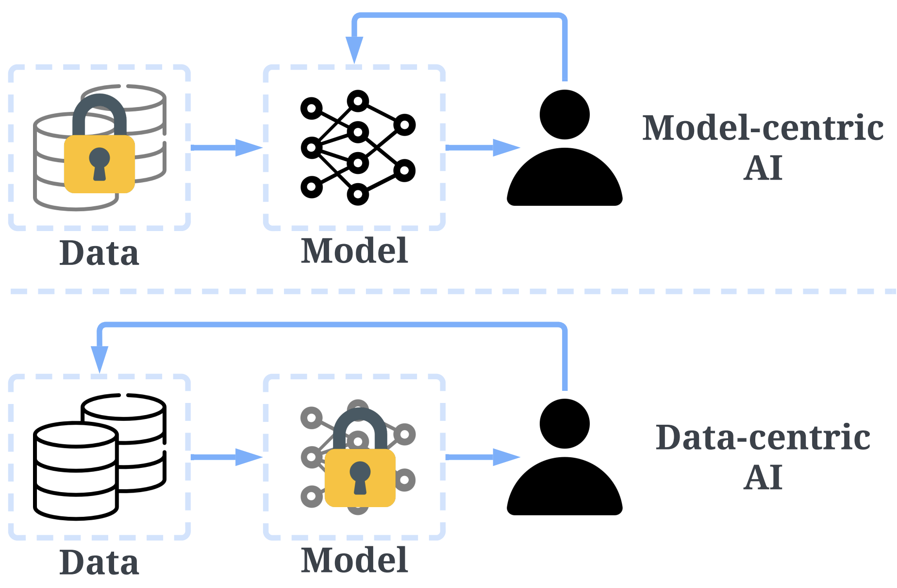
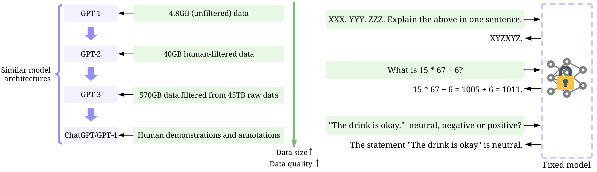
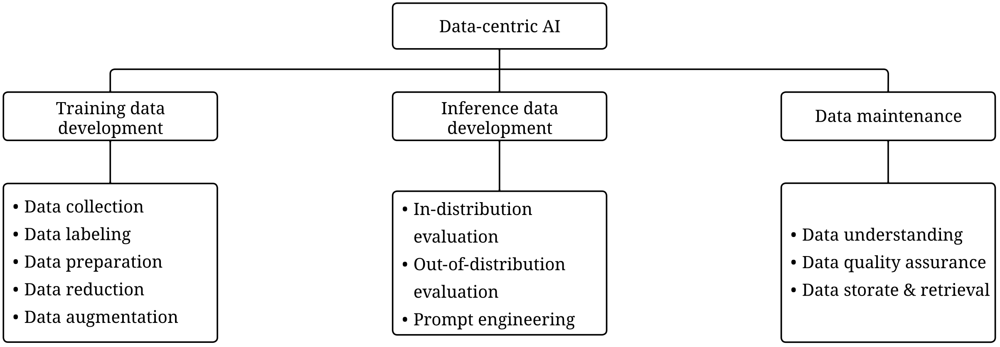
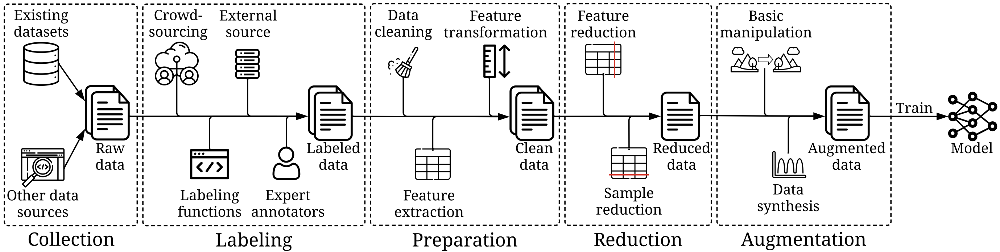
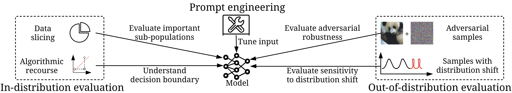

# Awesome-Data-Centric-AI
[](https://github.com/sindresorhus/awesome)

A curated, but incomplete, list of data-centric AI resources. It should be noted that it is unfeasible to encompass every paper. Thus, we prefer to selectively choose papers that present a range of distinct ideas. We welcome contributions to further enrich and refine this list.

If you want to contribute to this list, please feel free to send a pull request. Also you can contact [daochen.zha@rice.edu](mailto:daochen.zha@rice.edu).

*   Survey paper: [Data-centric Artificial Intelligence: A Survey](https://arxiv.org/abs/2303.10158)
*   Perspective paper (SDM 2023): [Data-centric AI: Perspectives and Challenges](https://arxiv.org/abs/2301.04819)
*   Blogs: 
    *   [What Are the Data-Centric AI Concepts behind GPT Models?](https://towardsdatascience.com/what-are-the-data-centric-ai-concepts-behind-gpt-models-a590071bb727)
*   中文解读: 
    *   [GPT模型成功的背后用到了哪些以数据为中心的人工智能（Data-centric AI）技术？](https://zhuanlan.zhihu.com/p/617057227)
    *   [如何评价Meta/FAIR 最新工作Segment Anything？](https://www.zhihu.com/question/593888697/answer/2972047807)
    *   [进行data-centric的研究时，需要的算力大吗？](https://www.zhihu.com/question/595473790/answer/2985057859)

## What is Data-centric AI?

Data-centric AI is an emerging field that focuses on engineering data to improve AI systems with enhanced data quality and quantity.

## Data-centric AI vs. Model-centric AI



In the conventional model-centric AI lifecycle, researchers and developers primarily focus on identifying more effective models to improve AI performance while keeping the data largely unchanged. However, this model-centric paradigm overlooks the potential quality issues and undesirable flaws of data, such as missing values, incorrect labels, and anomalies. Complementing the existing efforts in model advancement, **data-centric AI emphasizes the systematic engineering of data to build AI systems, shifting our focus from model to data**.

It is important to note that "data-centric" differs fundamentally from "data-driven", as the latter only emphasizes the use of data to guide AI development, which typically still centers on developing models rather than engineering data.


## Why Data-centric AI?


Two motivating examples of GPT models highlight the central role of data in AI.
*   On the left, large and high-quality training data are the driving force of recent successes of GPT models, while model architectures remain similar, except for more model weights.
*   On the right, when the model becomes sufficiently powerful, we only need to engineer prompts (inference data) to accomplish our objectives, with the model being fixed.

Another example is [Segment Anything](https://arxiv.org/abs/2304.02643), a foundation model for computer vision. The core of training Segment Anything lies in the large amount of annotated data, containing more than 1 billion masks, which is 400 times larger than existing segmentation datasets.

## What is the Data-centric AI Framework?


Data-centric AI framework consists of three goals: training data development, inference data development, and data maintenance, where each goal is associated with several sub-goals.

*   The goal of training data development is to collect and produce rich and high-quality training data to support the training of machine learning models.
*   The objective of inference data development is to create novel evaluation sets that can provide more granular insights into the model or trigger a specific capability of the model with engineered data inputs.
*   The purpose of data maintenance is to ensure the quality and reliability of data in a dynamic environment.

## Cite this Work
Zha, Daochen, et al. "Data-centric Artificial Intelligence: A Survey." arXiv preprint arXiv:2303.10158, 2023.
```bibtex
@article{zha2023data-centric-survey,
  title={Data-centric Artificial Intelligence: A Survey},
  author={Zha, Daochen and Bhat, Zaid Pervaiz and Lai, Kwei-Herng and Yang, Fan and Jiang, Zhimeng and Zhong, Shaochen and Hu, Xia},
  journal={arXiv preprint arXiv:2303.10158},
  year={2013}
}
```
Zha, Daochen, et al. "Data-centric AI: Perspectives and Challenges." SDM, 2023.
```bibtex
@inproceedings{zha2023data-centric-perspectives,
  title={Data-centric AI: Perspectives and Challenges},
  author={Zha, Daochen and Bhat, Zaid Pervaiz and Lai, Kwei-Herng and Yang, Fan and Hu, Xia},
  booktitle={SDM},
  year={2023}
}
```

## Table of Contents
* [Training Data Development](#training-data-development)
  * [Data Collection](#data-collection)
  * [Data Labeling](#data-labeling)
  * [Data Preparation](#data-preparation)
  * [Data Reduction](#data-reduction)
  * [Data Augmentation](#data-augmentation)
  * [Pipeline Search](#pipeline-search)
* [Inference Data Development](#inference-data-development)
  * [In-distribution Evaluation](#in-distribution-evaluation)
  * [Out-of-distribution Evaluation](#out-of-distribution-evaluation)
  * [Prompt Engineering](#prompt-engineering)
* [Data Maintenance](#data-maintenance)
  * [Data Understanding](#data-understanding)
  * [Data Quality Assurance](#data-quality-assurance)
  * [Data Storage and Retrieval](#data-storage-and-retrieval)
* [Data Benchmark](#data-benchmark)
  * [Training Data Development Benchmark](#training-data-development-benchmark)
  * [Inference Data Development Benchmark](#inference-data-development-benchmark)
  * [Data Maintenance Benchmark](#data-maintenance-benchmark)
  * [Unified Benchmark](#unified-benchmark)


## Training Data Development


### Data Collection

* Revisiting time series outlier detection: Definitions and benchmarks, NeurIPS 2021 [[Paper]](https://openreview.net/forum?id=r8IvOsnHchr) [[Code]](https://github.com/datamllab/tods)
* Dataset discovery in data lakes, ICDE 2020 [[Paper]](https://arxiv.org/pdf/2011.10427.pdf)
* Aurum: A data discovery system, ICDE 2018 [[Paper]](https://ieeexplore.ieee.org/document/8509315) [[Code]](https://github.com/mitdbg/aurum-datadiscovery)
* Table union search on open data, VLDB 2018 [[Paper]](https://dl.acm.org/doi/abs/10.14778/3192965.3192973)
* Data Integration: The Current Status and the Way Forward, IEEE Computer Society Technical Committee on Data Engineering 2018 [[Paper]](https://cs.uwaterloo.ca/~ilyas/papers/StonebrakerIEEE2018.pdf)
* To join or not to join? thinking twice about joins before feature selection, SIGMOD 2016 [[Paper]](https://pages.cs.wisc.edu/~arun/hamlet/OptFSSIGMOD.pdf) 
* Data curation at scale: the data tamer system, CIDR 2013 [[Paper]](https://cs.uwaterloo.ca/~ilyas/papers/StonebrakerCIDR2013.pdf) 
* Data integration: A theoretical perspective, PODS 2002 [[Paper]](https://www.cs.ubc.ca/~rap/teaching/534a/readings/Lenzerini-pods02.pdf)

### Data Labeling
* Segment Anything [[Paper]](https://scontent-hou1-1.xx.fbcdn.net/v/t39.2365-6/10000000_900554171201033_1602411987825904100_n.pdf?_nc_cat=100&ccb=1-7&_nc_sid=3c67a6&_nc_ohc=Ald4OYhL6hgAX-h7JxS&_nc_ht=scontent-hou1-1.xx&oh=00_AfCkb5vYTMBeCKRoya_B2sHuwAMcJrYJ08uJQdNkXDscLg&oe=643500E7) [[code]](https://github.com/facebookresearch/segment-anything)
* Active Ensemble Learning for Knowledge Graph Error Detection, WSDM 2023 [[Paper]](https://www4.comp.polyu.edu.hk/~xiaohuang/docs/Junnan_WSDM2023.pdf)
* Active-Learning-as-a-Service: An Efficient MLOps System for Data-Centric AI, NeurIPS 2022 Workshop on Human in the Loop Learning [[paper]](https://arxiv.org/abs/2207.09109) [[code]](https://github.com/MLSysOps/Active-Learning-as-a-Service)
* Training language models to follow instructions with human feedback, NeurIPS 2022 [[Paper]](https://arxiv.org/abs/2203.02155)
* Interactive Weak Supervision: Learning Useful Heuristics for Data Labeling, ICLR 2021 [[Paper]](https://arxiv.org/abs/2012.06046) [[Code]](https://github.com/benbo/interactive-weak-supervision)
* A survey of deep active learning, ACM Computing Surveys 2021 [[Paper]](https://arxiv.org/abs/2009.00236)
* Adaptive rule discovery for labeling text data, SIGMOD 2021 [[Paper]](https://arxiv.org/abs/2005.06133)
* Cut out the annotator, keep the cutout: better segmentation with weak supervision, ICLR 2021 [[Paper]](https://openreview.net/forum?id=bjkX6Kzb5H)
* Meta-AAD: Active anomaly detection with deep reinforcement learning, ICDM 2020 [[Paper]](https://arxiv.org/abs/2009.07415) [[Code]](https://github.com/daochenzha/Meta-AAD)
* Snorkel: Rapid training data creation with weak supervision, VLDB 2020 [[Paper]](https://arxiv.org/abs/1711.10160) [[Code]](https://github.com/snorkel-team/snorkel)
* Graph-based semi-supervised learning: A review, Neurocomputing 2020 [[Paper]](https://arxiv.org/abs/2102.13303) 
* Annotator rationales for labeling tasks in crowdsourcing, JAIR 2020 [[Paper]](https://www.ischool.utexas.edu/~ml/papers/kutlu_jair20.pdf)
* Rethinking pre-training and self-training, NeurIPS 2020 [[Paper]](https://arxiv.org/abs/2006.06882)
* Multi-label dataless text classification with topic modeling, KIS 2019 [[Paper]](https://arxiv.org/abs/1711.01563)
* Data programming: Creating large training sets, quickly, NeurIPS 2016 [[Paper]](https://arxiv.org/abs/1605.07723)
* Semi-supervised consensus labeling for crowdsourcing, SIGIR 2011 [[Paper]](http://www.cs.columbia.edu/~prokofieva/CandidacyPapers/Tang_Crowd.pdf)
* Vox Populi: Collecting High-Quality Labels from a Crowd, COLT 2009 [[Paper]](https://www.wisdom.weizmann.ac.il/~shamiro/publications/2009_COLT_DekSham.pdf)
* Democratic co-learning, ICTAI 2004 [[Paper]](https://ieeexplore.ieee.org/document/1374241)
* Active learning with statistical models, JAIR 1996 [[Paper]](https://arxiv.org/abs/cs/9603104)
 
### Data Preparation
* TSFEL: Time series feature extraction library, SoftwareX 2020 [[Paper]](https://www.sciencedirect.com/science/article/pii/S2352711020300017) [[Code]](https://github.com/fraunhoferportugal/tsfel)
* Alphaclean: Automatic generation of data cleaning pipelines, arXiv 2019 [[Paper]](https://arxiv.org/abs/1904.11827) [[Code]](https://github.com/sjyk/alphaclean)
* Introduction to Scikit-learn, Book 2019 [[Paper]](https://link.springer.com/chapter/10.1007/978-1-4842-4470-8_18) [[Code]](https://scikit-learn.org/stable/tutorial/basic/tutorial.html)
* Feature extraction: a survey of the types, techniques, applications, ICSC 2019 [[Paper]](https://ieeexplore.ieee.org/document/8938371) 
* Feature engineering for predictive modeling using reinforcement learning, AAAI 2018 [[Paper]](https://arxiv.org/abs/1709.07150)
* Time series classification from scratch with deep neural networks: A strong baseline, IIJCNN 2017 [[Paper]](https://arxiv.org/abs/1611.06455)
* Missing data imputation: focusing on single imputation, ATM 2016 [[Paper]](https://www.ncbi.nlm.nih.gov/pmc/articles/PMC4716933/) 
* Estimating the number and sizes of fuzzy-duplicate clusters, CIKM 2014 [[Paper]](https://dl.acm.org/doi/10.1145/2661829.2661885)
* Data normalization and standardization: a technical report, MLTR 2014 [[Paper]](https://www.researchgate.net/publication/340579135_Data_Normalization_and_Standardization_A_Technical_Report)
* CrowdER: crowdsourcing entity resolution, VLDB 2012 [[Paper]](https://vldb.org/pvldb/vol5/p1483_jiannanwang_vldb2012.pdf)
* Imputation of Missing Data Using Machine Learning Techniques, KDD 1996 [[Paper]](https://d1wqtxts1xzle7.cloudfront.net/75598281/KDD96-023-libre.pdf?1638499004=&response-content-disposition=inline%3B+filename%3DImputation_of_Missing_Data_Using_Machine.pdf&Expires=1678667994&Signature=BNTzHGy7~TevRwBAyUu4QCeyNWOC7vH9RcG3bx6zGHjO4mTZa1DAv8GznqsJP25EKorca59PX4R2BYrWiFgTXvtXDwgB7lgvWa0B~W6Z3fjosZLWyMRAjAuhDbFdc-jhI1vlaXHIwzvetDG6ldZZJJCNj6fY0JmkgGcFLP52JR0wy02LjxlPwgAaRyrx1m1-4MvKi-4qS9N~J55ddEchqjcezfREIOA-ab2izlrIH~nzh4UTY7D2uiPmEKQiA85wOfkI0KFjImqGiLiIEo82uA071MjdgkWfPBUrrS60EQT89bDrn-PeCHMXKCE0WnaK0MUm5tOF62h~KLU-D5y5Dg__&Key-Pair-Id=APKAJLOHF5GGSLRBV4ZA) 

### Data Reduction
* Active feature selection for the mutual information criterion, AAAI 2021 [[Paper]](https://arxiv.org/abs/2012.06979) [[Code]](https://github.com/ShacharSchnapp/ActiveFeatureSelection)
* Active incremental feature selection using a fuzzy-rough-set-based information entropy, IEEE Transactions on Fuzzy Systems, 2020 [[Paper]](https://ieeexplore.ieee.org/document/8933450)
* MESA: boost ensemble imbalanced learning with meta-sampler, NeurIPS 2020 [[Paper]](https://arxiv.org/abs/2010.08830) [[Code]](https://github.com/ZhiningLiu1998/mesa)
* Autoencoders, arXiv 2020 [[Paper]](https://arxiv.org/abs/2003.05991)
* Feature selection: A data perspective, ACM COmputer Surveys, 2017 [[Paper]](https://dl.acm.org/doi/abs/10.1145/3136625) [[Code]](http://featureselection.asu.edu/)
* Intrusion detection model using fusion of chi-square feature selection and multi class SVM, Journal of King Saud University-Computer and Information Sciences 2017 [[Paper]](https://www.researchgate.net/publication/299567135_Intrusion_Detection_Model_Using_fusion_of_Chi-square_feature_selection_and_multi_class_SVM) 
* Feature selection and analysis on correlated gas sensor data with recursive feature elimination, Sensors and Actuators B: Chemical 2015 [[Paper]](https://www.sciencedirect.com/science/article/abs/pii/S0925400515001872) 
* Embedded unsupervised feature selection, AAAI 2015 [[Paper]](https://faculty.ist.psu.edu/szw494/publications/EUFS.pdf)
* Using random undersampling to alleviate class imbalance on tweet sentiment data, ICIRI 2015 [[Paper]](https://ieeexplore.ieee.org/document/7300975)
* Feature selection based on information gain, IJITEE 2013 [[Paper]](https://citeseerx.ist.psu.edu/document?repid=rep1&type=pdf&doi=e17df473c25cccd8435839c9b6150ee61bec146a)
* Linear discriminant analysis, Book 2013 [[Paper]](https://link.springer.com/chapter/10.1007/978-1-4419-9878-1_4) 
* Introduction to k nearest neighbour classification and condensed nearest neighbour data reduction, 2012 [[Paper]](http://www.math.le.ac.uk/people/ag153/homepage/KNN/OliverKNN_Talk.pdf)
* Principal component analysis, Wiley Interdisciplinary Reviews 2010 [[Paper]](https://wires.onlinelibrary.wiley.com/doi/abs/10.1002/wics.101?casa_token=7GCaA_PLs7YAAAAA:X9iYhUUhXB-3kTi-sQfPjVliujsPep6Iin7Cs9ld8wv3ECz9oeFuPEeaA_AfM0QH-cQkaD3kDoTL5sA) [[Code]](https://github.com/erdogant/pca)
* Finding representative patterns with ordered projections, Pattern Recognition 2003 [[Paper]](https://www.sciencedirect.com/science/article/abs/pii/S003132030200119X)


### Data Augmentation
* Towards automated imbalanced learning with deep hierarchical reinforcement learning, CIKM 2022 [[Paper]](https://arxiv.org/abs/2208.12433) [[Code]](https://github.com/daochenzha/autosmote)
* G-Mixup: Graph Data Augmentation for Graph Classification, ICML 2022 [[Paper]](https://arxiv.org/abs/2202.07179) [[Code]](https://github.com/ahxt/g-mixup)
* Cascaded Diffusion Models for High Fidelity Image Generation, JMLR 2022 [[Paper]](https://arxiv.org/abs/2106.15282)
* Time series data augmentation for deep learning: A survey, IJCAI 2021 [[Paper]](https://arxiv.org/abs/2002.12478)
* Text data augmentation for deep learning, JBD 2020 [[Paper]](https://journalofbigdata.springeropen.com/articles/10.1186/s40537-021-00492-0)
* Mixtext: Linguistically-informed interpolation of hidden space for semi-supervised text classification, ACL 2020 [[Paper]](https://arxiv.org/abs/2004.12239) [[Code]](https://github.com/SALT-NLP/MixText)
* Autoaugment: Learning augmentation policies from data, CVPR 2019 [[Paper]](https://arxiv.org/abs/1805.09501) [[Code]](https://github.com/DeepVoltaire/AutoAugment)
* Mixup: Beyond empirical risk minimization, ICLR 2018 [[Paper]](https://arxiv.org/abs/1710.09412) [[Code]](https://github.com/facebookresearch/mixup-cifar10)
* Synthetic data augmentation using GAN for improved liver lesion classification, ISBI 2018 [[Paper]](https://arxiv.org/abs/1801.02385) [[Code]](https://github.com/NicoEssi/GAN_Synthetic_Medical_Image_Augmentation)
* Unsupervised domain adaptation for robust speech recognition via variational autoencoder-based data augmentation, ASRU 2017 [[Paper]](https://arxiv.org/abs/1707.06265)
* Character-level convolutional networks for text classification, NeurIPS 2015 [[Paper]](https://arxiv.org/abs/1509.01626) [[Code]](https://github.com/zhangxiangxiao/Crepe)
* ADASYN: Adaptive synthetic sampling approach for imbalanced learning, IJCNN 2008 [[Paper]](https://sci2s.ugr.es/keel/pdf/algorithm/congreso/2008-He-ieee.pdf) [[Code]](https://github.com/stavskal/ADASYN)
* SMOTE: synthetic minority over-sampling technique, JAIR 2002 [[Paper]](https://arxiv.org/abs/1106.1813) [[Code]](https://github.com/analyticalmindsltd/smote_variants)

### Pipeline Search
* Towards Personalized Preprocessing Pipeline Search, arXiv 2023 [[Paper]](https://arxiv.org/pdf/2302.14329v1.pdf) 
* AutoVideo: An Automated Video Action Recognition System, IJCAI 2022 [[Paper]](https://arxiv.org/abs/2108.04212) [[Code]](https://github.com/datamllab/autovideo)
* Tods: An automated time series outlier detection system, AAAI 2021 [[Paper]](https://arxiv.org/abs/2009.09822) [[Code]](https://github.com/datamllab/tods)
* Deepline: Automl tool for pipelines generation using deep reinforcement learning and hierarchical actions filtering, KDD 2020 [[Paper]](https://arxiv.org/abs/1911.00061) 
* On evaluation of automl systems, ICML 2020 [[Paper]](https://www.automl.org/wp-content/uploads/2020/07/AutoML_2020_paper_59.pdf)
* AlphaD3M: Machine learning pipeline synthesis, ICML 2018 [[Paper]](https://arxiv.org/abs/2111.02508)
* Efficient and robust automated machine learning, NeurIPS 2015 [[Paper]](https://papers.nips.cc/paper/2015/file/11d0e6287202fced83f79975ec59a3a6-Paper.pdf) [[Code]](https://paperswithcode.com/paper/efficient-and-robust-automated-machine)

## Inference Data Development


### In-distribution Evaluation
* FOCUS: Flexible optimizable counterfactual explanations for tree ensembles, AAAI 2022 [[Paper]](https://arxiv.org/abs/1911.12199) [[Code]](https://github.com/a-lucic/focus)
* Sliceline: Fast, linear-algebra-based slice finding for ml model debugging, SIGMOD 2021 [[Paper]](https://dl.acm.org/doi/10.1145/3448016.3457323) [[Code]](https://github.com/DataDome/sliceline)
* Counterfactual explanations for oblique decision trees: Exact, efficient algorithms, AAAI 2021 [[Paper]](https://arxiv.org/abs/2103.01096)
* A Step Towards Global Counterfactual Explanations: Approximating the Feature Space Through Hierarchical Division and Graph Search, AAIML 2021 [[Paper]](https://www.researchgate.net/publication/357175710_A_Step_Towards_Global_Counterfactual_Explanations_Approximating_the_Feature_Space_Through_Hierarchical_Division_and_Graph_Search) 
* An exact counterfactual-example-based approach to tree-ensemble models interpretability, arXiv 2021 [[Paper]](https://arxiv.org/abs/2105.14820) [[Code]](https://paperswithcode.com/paper/an-exact-counterfactual-example-based)
* No subclass left behind: Fine-grained robustness in coarse-grained classification problems, NeurIPS 2020 [[Paper]](https://arxiv.org/abs/2011.12945) [[Code]](https://paperswithcode.com/paper/no-subclass-left-behind-fine-grained-1)
* FACE: feasible and actionable counterfactual explanations, AIES 2020 [[Paper]](https://arxiv.org/abs/1909.09369) [[Code]](https://github.com/sharmapulkit/FACE-Feasible-Actionable-Counterfactual-Explanations)
* DACE: Distribution-Aware Counterfactual Explanation by Mixed-Integer Linear Optimization, IJCAI 2020 [[Paper]](https://www.ijcai.org/proceedings/2020/0395.pdf)
* Multi-objective counterfactual explanations, arXiv 2020 [[Paper]](https://arxiv.org/abs/2004.11165) [[Code]](https://github.com/dandls/moc)
* Certifai: Counterfactual explanations for robustness, transparency, interpretability, and fairness of artificial intelligence models, AIES 2020 [[Paper]](https://arxiv.org/abs/1905.07857) [[Code]]()
* Propublica's compas data revisited, arXiv 2019 [[Paper]](https://arxiv.org/abs/1906.04711)
* Slice finder: Automated data slicing for model validation, ICDE 2019 [[Paper]](https://research.google/pubs/pub47966/) [[Code]](https://github.com/yeounoh/slicefinder)
* Multiaccuracy: Black-box post-processing for fairness in classification, AIES 2019 [[Paper]](https://arxiv.org/abs/1805.12317) [[Code]](https://github.com/amiratag/MultiAccuracyBoost)
* Model agnostic contrastive explanations for structured data, arXiv 2019 [[Paper]](https://arxiv.org/abs/1906.00117)
* Counterfactual explanations without opening the black box: Automated decisions and the GDPR, Harvard Journal of Law & Technology 2018 [[Paper]](https://arxiv.org/abs/1711.00399)
* Comparison-based inverse classification for interpretability in machine learning, IPMU 2018 [[Paper]](https://link.springer.com/chapter/10.1007/978-3-319-91473-2_9)
* Quantitative program slicing: Separating statements by relevance, ICSE 2013 [[Paper]](https://ieeexplore.ieee.org/document/6606695)
* Stratal slicing, Part II: Real 3-D seismic data, Geophysics 1998 [[Paper]](https://library.seg.org/doi/abs/10.1190/1.1444352)


### Out-of-distribution Evaluation
* A brief review of domain adaptation, Transactions on Computational Science and Computational Intelligenc 2021 [[Paper]](https://arxiv.org/pdf/2010.03978v1.pdf)
* Domain adaptation for medical image analysis: a survey, IEEE Transactions on Biomedical Engineering 2021 [[Paper]](https://arxiv.org/pdf/2102.09508v1.pdf)
* Retiring adult: New datasets for fair machine learning, NeurIPS 2021 [[Paper]](https://arxiv.org/pdf/2108.04884v3.pdf) [[Code]](https://github.com/socialfoundations/folktables)
* Wilds: A benchmark of in-the-wild distribution shifts, ICML 2021 [[Paper]](https://arxiv.org/pdf/2012.07421v3.pdf) [[Code]](https://github.com/p-lambda/wilds)
* Do image classifiers generalize across time?, ICCV 2021 [[Paper]](https://arxiv.org/pdf/1906.02168v3.pdf)
* Using videos to evaluate image model robustness, arXiv 2019 [[Paper]](https://arxiv.org/abs/1904.10076) 
* Regularized learning for domain adaptation under label shifts, ICLR 2019 [[Paper]](https://arxiv.org/pdf/1903.09734v1.pdf) [[Code]](https://github.com/Angie-Liu/labelshift)
* Benchmarking neural network robustness to common corruptions and perturbations, ICLR 2019 [[Paper]](https://arxiv.org/abs/1903.12261) [[Code]](https://github.com/hendrycks/robustness)
* Towards deep learning models resistant to adversarial attacks, ICLR 2018 [[Paper]](https://arxiv.org/pdf/1706.06083v4.pdf) [[Code]](https://paperswithcode.com/paper/towards-deep-learning-models-resistant-to)
* Robust physical-world attacks on deep learning visual classification, CVPR 2018 [[Paper]](http://openaccess.thecvf.com/content_cvpr_2018/papers/Eykholt_Robust_Physical-World_Attacks_CVPR_2018_paper.pdf) 
* Detecting and correcting for label shift with black box predictors, ICML 2018 [[Paper]](https://arxiv.org/pdf/1802.03916v3.pdf)
* Poison frogs! targeted clean-label poisoning attacks on neural networks, NeurIPS 2018 [[Paper]](https://arxiv.org/pdf/1804.00792v2.pdf) [[Code]](https://github.com/ashafahi/inceptionv3-transferLearn-poison)
* Practical black-box attacks against machine learning, CCS 2017 [[Paper]](https://arxiv.org/pdf/1602.02697v4.pdf)
* Zoo: Zeroth order optimization based black-box attacks to deep neural networks without training substitute models, AISec 2017 [[Paper]](https://arxiv.org/pdf/1708.03999v2.pdf) [[Code]](https://github.com/huanzhang12/ZOO-Attack)
* Deepfool: a simple and accurate method to fool deep neural networks, CVPR 2016 [[Paper]](https://arxiv.org/pdf/1511.04599v3.pdf) [[Code]](https://github.com/LTS4/DeepFool)
* Evasion attacks against machine learning at test time, ECML PKDD 2013 [[Paper]](https://arxiv.org/pdf/1708.06131v1.pdf) [[Code]](https://github.com/Koukyosyumei/AIJack)
* Adapting visual category models to new domains, ECCV 2010 [[Paper]](https://link.springer.com/chapter/10.1007/978-3-642-15561-1_16)
* Covariate shift by kernel mean matching, MIT Press 2009 [[Paper]](https://academic.oup.com/mit-press-scholarship-online/book/13447/chapter-abstract/166932982?redirectedFrom=fulltext)
* Covariate shift adaptation by importance weighted cross validation, JMLR 2007 [[Paper]](https://www.jmlr.org/papers/volume8/sugiyama07a/sugiyama07a.pdf) 

### Prompt Engineering
* SPeC: A Soft Prompt-Based Calibration on Mitigating Performance Variability in Clinical Notes Summarization, arXiv 2023 [[Paper]](https://arxiv.org/pdf/2303.13035.pdf)
* Making Pre-trained Language Models Better Few-shot Learners, arXiv 2021 [[Paper]](https://arxiv.org/pdf/2012.15723v2.pdf) [[Code]](https://github.com/princeton-nlp/LM-BFF)
* Bartscore: Evaluating generated text as text generation, NeurIPS 2021 [[Paper]](https://arxiv.org/pdf/2106.11520v2.pdf) [[Code]](https://github.com/neulab/BARTScore)
* BERTese: Learning to Speak to BERT, arXiv 2021 [[Paper]](https://arxiv.org/pdf/2103.05327v2.pdf)
* Few-shot text generation with pattern-exploiting training, arXiv 2020 [[Paper]](https://arxiv.org/pdf/2012.11926v2.pdf) 
* Exploiting cloze questions for few shot text classification and natural language inference, arXiv 2020 [[Paper]](https://arxiv.org/pdf/2001.07676v3.pdf) [[Code]](https://github.com/timoschick/pet)
* It's not just size that matters: Small language models are also few-shot learners, arXiv 2020 [[Paper]](https://arxiv.org/pdf/2009.07118v2.pdf)
* How can we know what language models know?, TACL 2020 [[Paper]](https://arxiv.org/pdf/1911.12543v2.pdf) [[Code]](https://github.com/jzbjyb/LPAQA)
* Universal adversarial triggers for attacking and analyzing NLP, EMNLP 2019 [[Paper]](https://arxiv.org/pdf/1908.07125v3.pdf) [[Code]](https://github.com/Eric-Wallace/universal-triggers)


## Data Maintenance


### Data Understanding
* The science of visual data communication: What works, Psychological Science in the Public Interest 2021 [[Paper]](https://journals.sagepub.com/doi/full/10.1177/15291006211051956)
* Towards out-of-distribution generalization: A survey, arXiv 2021 [[Paper]](https://arxiv.org/abs/2108.13624) 
* Snowy: Recommending utterances for conversational visual analysis, UIST 2021 [[Paper]](https://arxiv.org/abs/2110.04323) 
* A distributional framework for data valuation, ICML 2020 [[Paper]](https://arxiv.org/abs/2002.12334)
* A comparison of radial and linear charts for visualizing daily patterns, TVCG 2020 [[Paper]](https://ieeexplore.ieee.org/abstract/document/8807238)
* A marketplace for data: An algorithmic solution, EC 2019 [[Paper]](https://arxiv.org/abs/1805.08125)
* Data shapley: Equitable valuation of data for machine learning, PMLR 2019 [[Paper]](https://arxiv.org/abs/1904.02868) [[Code]](https://github.com/amiratag/DataShapley)
* Deepeye: Towards automatic data visualization, ICDE 2018 [[Paper]](https://dbgroup.cs.tsinghua.edu.cn/ligl/papers/icde18-deepeye.pdf) [[Code]](https://github.com/Thanksyy/DeepEye-APIs)
* Voyager: Exploratory analysis via faceted browsing of visualization recommendations, TVCG 2016 [[Paper]](https://idl.cs.washington.edu/files/2015-Voyager-InfoVis.pdf)
* A survey of clustering algorithms for big data: Taxonomy and empirical analysis, TETC 2014 [[Paper]](https://ieeexplore.ieee.org/document/6832486)
* On the benefits and drawbacks of radial diagrams, Handbook of Human Centric Visualization 2013 [[Paper]](https://link.springer.com/chapter/10.1007/978-1-4614-7485-2_17)
* What makes a visualization memorable?, TVCG 2013 [[Paper]](https://ieeexplore.ieee.org/document/6634103) 
* Toward a taxonomy of visuals in science communication, Technical Communication 2011 [[Paper]](https://www.jstor.org/stable/26464332)

### Data Quality Assurance
* Human-AI Collaboration for Improving the Identification of Cars for Autonomous Driving, CIKM Workshop 2022 [[Paper]](https://ceur-ws.org/Vol-3318/short14.pdf) 
* A Human-ML Collaboration Framework for Improving Video Content Reviews, arXiv 2022 [[Paper]](https://arxiv.org/abs/2210.09500) 
* Knowledge graph quality management: a comprehensive survey, TKDE 2022 [[Paper]](https://ieeexplore.ieee.org/document/9709663)
* A crowdsourcing open platform for literature curation in UniProt, PLoS Biol. 2021 [[Paper]](https://pubmed.ncbi.nlm.nih.gov/34871295/) [[Code]]()
* Building data curation processes with crowd intelligence, Advanced Information Systems Engineering 2020 [[Paper]](https://link.springer.com/chapter/10.1007/978-3-030-58135-0_3)
* Data Curation with Deep Learning, EDBT, 2020 [[Paper]](https://openproceedings.org/2020/conf/edbt/paper_142.pdf)
* Automating large-scale data quality verification, VLDB 2018 [[Paper]](https://dl.acm.org/doi/abs/10.14778/3229863.3229867) 
* Data quality: The role of empiricism, SIGMOD 2017 [[Paper]](https://sigmodrecord.org/publications/sigmodRecord/1712/pdfs/07_forum_Sadiq.pdf)
* Tfx: A tensorflow-based production-scale machine learning platform, KDD 2017 [[Paper]](https://research.google/pubs/pub46484/) [[Code]](https://github.com/tensorflow/tfx)
* Discovering denial constraints, VLDB 2013 [[Paper]](http://www.vldb.org/pvldb/vol6/p1498-papotti.pdf) [[Code]](https://github.com/ah89/ApproxDC)
* Methodologies for data quality assessment and improvement, ACM Computing Surveys 2009 [[Paper]](https://dl.acm.org/doi/10.1145/1541880.1541883)
* Conditional functional dependencies for data cleaning, ICDE 2007 [[Paper]](https://homepages.inf.ed.ac.uk/wenfei/papers/icde07-cfd.pdf)
* Data quality assessment, Communications of the ACM 2002 [[Paper]](https://dl.acm.org/doi/pdf/10.1145/505248.506010) 


### Data Storage and Retrieval
* Dbmind: A self-driving platform in opengauss, PVLDB 2021 [[Paper]](http://vldb.org/pvldb/vol14/p2743-zhou.pdf)
* Online index selection using deep reinforcement learning for a cluster database, ICDEW 2020 [[Paper]](https://ieeexplore.ieee.org/document/9094124) 
* Bridging the semantic gap with SQL query logs in natural language interfaces to databases, ICDE 2019 [[Paper]](https://arxiv.org/abs/1902.00031)
* An end-to-end learning-based cost estimator, VLDB 2019 [[Paper]](https://arxiv.org/abs/1906.02560) [[Code]](https://github.com/greatji/Learning-based-cost-estimator)
* An adaptive approach for index tuning with learning classifier systems on hybrid storage environments, Hybrid Artificial Intelligent Systems 2018 [[Paper]](https://link.springer.com/chapter/10.1007/978-3-319-92639-1_60)
* Automatic database management system tuning through large-scale machine learning, SIGMOD 2017 [[Paper]](https://www.cs.cmu.edu/~ggordon/van-aken-etal-parameters.pdf)
* Learning to rewrite queries, CIKM 2016 [[Paper]](http://www.yichang-cs.com/yahoo/CIKM2016_rewrite.pdf)
* DBridge: A program rewrite tool for set-oriented query execution, IEEE ICDE 2011 [[Paper]](https://www.semanticscholar.org/paper/DBridge%3A-A-program-rewrite-tool-for-set-oriented-Chavan-Guravannavar/39b214a86cd6c3fd7fe359ce2127dd17e163452c) 
* Starfish: A Self-tuning System for Big Data Analytics, CIDR 2011 [[Paper]](https://www.researchgate.net/publication/220988112_Starfish_A_Self-tuning_System_for_Big_Data_Analytics) [[Code]](https://github.com/mostafa-ead/Starfish)
* DB2 advisor: An optimizer smart enough to recommend its own indexes, ICDE 2000 [[Paper]](https://www.researchgate.net/publication/220967569_DB2_Advisor_An_Optimizer_Smart_Enough_to_Recommend_its_own_Indexes) 
* An efficient, cost-driven index selection tool for Microsoft SQL server, VLDB 1997 [[Paper]](https://www.vldb.org/conf/1997/P146.PDF)

## Data Benchmark

### Training Data Development Benchmark
* REIN: A Comprehensive Benchmark Framework for Data Cleaning Methods in ML Pipelines, PVLDB 2023 [[Paper]](https://arxiv.org/abs/2302.04702) [[Code]](https://github.com/mohamedyd/rein-benchmark)
* Usb: A unified semi-supervised learning benchmark for classification, NeurIPS 2022 [[Paper]](https://arxiv.org/abs/2208.07204) [[Code]](https://github.com/microsoft/Semi-supervised-learning)
* A feature extraction & selection benchmark for structural health monitoring, Structural Health Monitoring 2022 [[Paper]](https://journals.sagepub.com/doi/full/10.1177/14759217221111141)
* Data augmentation for deep graph learning: A survey, KDD 2022 [[Paper]](https://arxiv.org/abs/2202.08235)
* Blood-based transcriptomic signature panel identification for cancer diagnosis: benchmarking of feature extraction methods, Briefings in Bioinformatics 2022 [[Paper]](https://pubmed.ncbi.nlm.nih.gov/35945147/) [[Code]](https://github.com/abhivij/bloodbased-pancancer-diagnosis)
* Amlb: an automl benchmark, arXiv 2022 [[Paper]](https://arxiv.org/abs/2207.12560)
* A benchmark for data imputation methods, Front. Big Data 2021 [[Paper]](https://www.ncbi.nlm.nih.gov/pmc/articles/PMC8297389/) [[Code]](https://github.com/se-jaeger/data-imputation-paper)
* Benchmark and survey of automated machine learning frameworks, JAIR 2021 [[Paper]](https://arxiv.org/abs/1904.12054) 
* Benchmarking differentially private synthetic data generation algorithms, arXiv 2021 [[Paper]](https://arxiv.org/abs/2112.09238)
* A comprehensive benchmark framework for active learning methods in entity matching, SIGMOD 2020 [[Paper]](https://arxiv.org/abs/2003.13114)
* Rethinking data augmentation for image super-resolution: A comprehensive analysis and a new strategy, CVPR 2020 [[Paper]](https://arxiv.org/abs/2004.00448) [[Code]](https://github.com/clovaai/cutblur)
* Comparison of instance selection and construction methods with various classifiers, Applied Sciences 2020 [[Paper]](https://www.mdpi.com/2076-3417/10/11/3933)
* An empirical survey of data augmentation for time series classification with neural networks, arXiv 2020 [[Paper]](https://arxiv.org/abs/2007.15951) [[Code]](https://github.com/uchidalab/time_series_augmentation)
* Toward a quantitative survey of dimension reduction techniques, IEEE Transactions on Visualization and Computer Graphics 2019 [[Paper]](https://pubmed.ncbi.nlm.nih.gov/31567092/) [[Code]](https://mespadoto.github.io/proj-quant-eval/post/datasets/)
* Cleanml: A benchmark for joint data cleaning and machine learning experiments and analysis, arXiv 2019 [[Paper]](https://arxiv.org/abs/1904.09483) [[Code]](https://github.com/chu-data-lab/CleanML)
* Comparison of different image data augmentation approaches, Journal of Big Data 2019 [[Paper]](https://www.ncbi.nlm.nih.gov/pmc/articles/PMC8707550/) [[Code]]()
* A benchmark and comparison of active learning for logistic regression, Pattern Recognition 2018 [[Paper]](https://arxiv.org/abs/1611.08618)
* A publicly available benchmark for biomedical dataset retrieval: the reference standard for the 2016 bioCADDIE dataset retrieval challenge, Database (Oxford). 2017 [[Paper]](https://www.ncbi.nlm.nih.gov/pmc/articles/PMC5737202/) [[Data]](https://ngdc.cncb.ac.cn/databasecommons/database/id/3366)
* RODI: A benchmark for automatic mapping generation in relational-to-ontology data integration, ESWC 2015 [[Paper]](https://link.springer.com/chapter/10.1007/978-3-319-18818-8_2) [[Code]](https://github.com/chrpin/rodi)
* TPC-DI: the first industry benchmark for data integration, PVLDB 2014 [[Paper]](http://www.vldb.org/pvldb/vol7/p1367-poess.pdf)
* Comparison of instance selection algorithms II. Results and comments, ICAISC 2004 [[Paper]](https://link.springer.com/chapter/10.1007/978-3-540-24844-6_87)

### Inference Data Development Benchmark
* Beyond the imitation game: Quantifying and extrapolating the capabilities of language models, arXiv 2023 [[Paper]](https://arxiv.org/abs/2206.04615) [[Code]](https://github.com/google/BIG-bench)
* Carla: a python library to benchmark algorithmic recourse and counterfactual explanation algorithms, arXiv 2021 [[Paper]](https://arxiv.org/abs/2108.00783) [[Code]](https://github.com/carla-recourse/CARLA)
* Benchmarking adversarial robustness on image classification, CVPR 2020 [[Paper]](https://openaccess.thecvf.com/content_CVPR_2020/papers/Dong_Benchmarking_Adversarial_Robustness_on_Image_Classification_CVPR_2020_paper.pdf)
* Searching for a search method: Benchmarking search algorithms for generating nlp adversarial examples, ACL Workshop 2020 [[Code]](https://github.com/QData/TextAttack)
* Benchmarking neural network robustness to common corruptions and perturbations, ICLR 2019 [[Paper]](https://arxiv.org/abs/1903.12261) [[Code]](https://github.com/hendrycks/robustness) [[Code]]()

### Data Maintenance Benchmark
* Chart-to-text: A large-scale benchmark for chart summarization, ACL 2022 [[Paper]](https://arxiv.org/abs/2203.06486) [[Code]](https://github.com/JasonObeid/Chart2Text)
* Scalability vs. utility: Do we have to sacrifice one for the other in data importance quantification?, CVPR 2021 [[Paper]](https://arxiv.org/abs/1911.07128) [[Code]](https://github.com/AI-secure/Shapley-Study)
* An evaluation-focused framework for visualization recommendation algorithms, IEEE Transactions on Visualization and Computer Graphics 2021 [[Paper]](https://arxiv.org/abs/2109.02706) [[Code]](https://github.com/Zehua-Zeng/visualization-recommendation-evaluation)
* Facilitating database tuning with hyper-parameter optimization: a comprehensive experimental evaluation, VLDB 2021 [[Paper]](https://arxiv.org/abs/2110.12654) [[Code]](https://github.com/PKU-DAIR/KnobsTuningEA)
* Benchmarking Data Curation Systems, 
IEEE Data Eng. Bull. 2016 [[Paper]](http://sites.computer.org/debull/A16june/p47.pdf) 
* Methodologies for data quality assessment and improvement, ACM Computing Surveys 2009 [[Paper]](https://dl.acm.org/doi/10.1145/1541880.1541883)
* Benchmark development for the evaluation of visualization for data mining, Information visualization in data mining and knowledge discovery 2001 [[Paper]](https://nvlpubs.nist.gov/nistpubs/Legacy/IR/nistir6287.pdf)

### Unified Benchmark
* Dataperf: Benchmarks for data-centric AI development, arXiv 2022 [[Paper]](https://arxiv.org/abs/2207.10062) 

